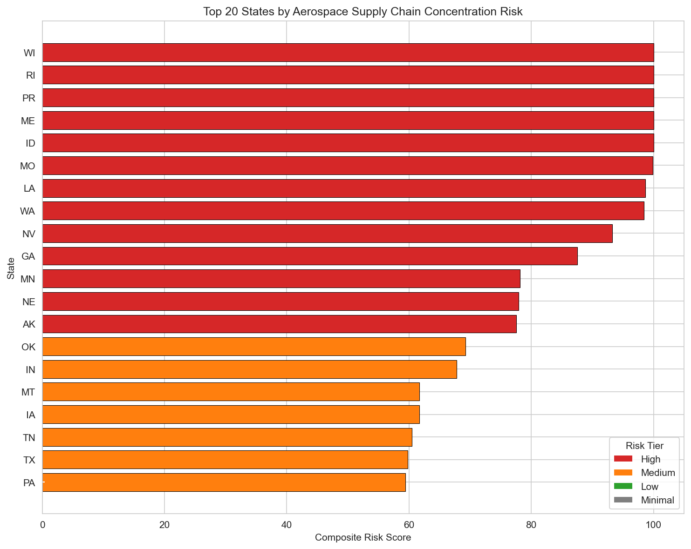
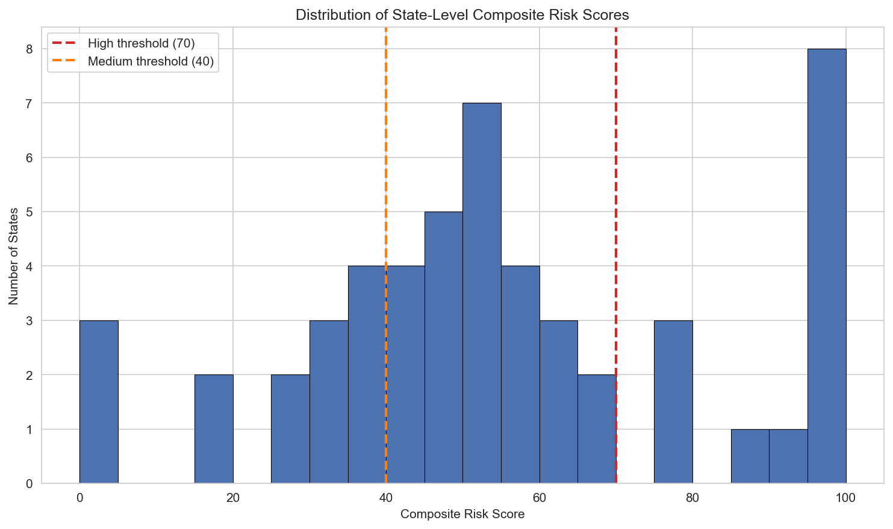
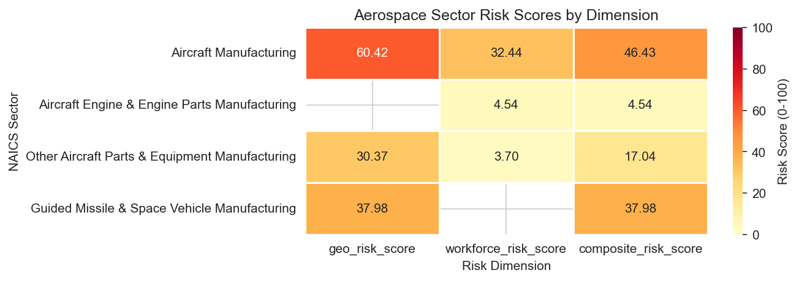
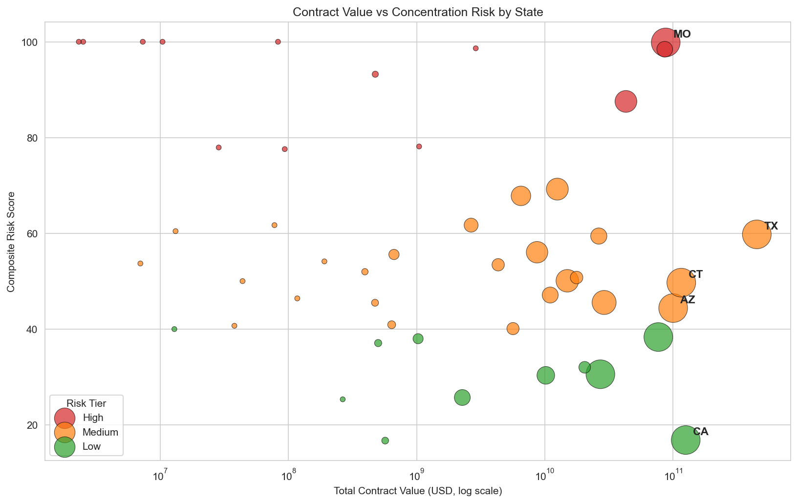

# Aerospace Supply Chain Risk AI

An end-to-end data pipeline and AI system that scores aerospace 
supply chain risk across all 50 US states and 4 NAICS sectors, 
then generates analyst-style procurement risk briefs using the 
Claude API.

Built as a 21-day public project targeting real industry problems 
in aerospace supply chain resilience.

**GitHub:** https://github.com/shravankumaar31/Aerospace-supply-chain-risk-ai

---

## Why This Exists

The US aerospace supply chain is dangerously concentrated. This 
project quantifies that risk using public government data and 
surfaces it through AI-generated briefs that procurement analysts 
would otherwise write by hand.

47 out of 52 states score High concentration risk. 5 states have 
a single-vendor monopoly (HHI = 10,000). Aircraft Manufacturing 
exports are 14% dependent on Saudi Arabia. This tool makes that 
visible.

---

## Architecture

**Data Sources → Ingestion → Unification → Risk Scoring → AI Briefs → Dashboard**

1. **Ingest** — Three scripts pull from public APIs:
   - `src/ingest/usaspending.py` → USASpending.gov contract awards
   - `src/ingest/census_trade.py` → Census Bureau trade data  
   - `src/ingest/bls_employment.py` → BLS employment data

2. **Unify** — `src/transform/unify.py` merges all sources into SQLite (`data/processed/supply_chain.db`)

3. **Score** — Three independent risk modules:
   - `src/risk/concentration.py` → HHI per state
   - `src/risk/geographic.py` → Export dependency per NAICS
   - `src/risk/workforce.py` → Employment volatility per NAICS

4. **Composite** — `src/risk/composite.py` combines all scores into `composite_risk_score` + `risk_tier`

5. **Brief** — `src/ai/brief_generator.py` sends risk data to Claude API → returns analyst-style procurement brief

6. **Dashboard** — `src/app/app.py` Streamlit app with Plotly choropleth map and AI brief panel

---

## Tech Stack

| Tool | Purpose |
|---|---|
| Python 3.11 | Core language |
| pandas | Data transformation |
| SQLite | Unified data store |
| requests | API ingestion |
| Anthropic Claude API | AI brief generation |
| Streamlit | Interactive dashboard |
| Plotly | Choropleth map |
| pytest | Risk scoring validation |
| GitHub Actions | Automated pipeline |

---

## Data Sources

| Source | What it provides | Records |
|---|---|---|
| USASpending.gov | Aerospace contract awards FY2022-2024 | 10,000 awards |
| Census Bureau International Trade | Aerospace export values by country | 718 country rows |
| BLS Public Data API | Aerospace employment by sector | 108 monthly records |

---

## How It Works

**Step 1 - Ingest:** Three scripts pull public data from USASpending.gov, Census Bureau, and BLS APIs. No API keys required for ingestion.

**Step 2 - Unify:** All sources merged into a single SQLite database with 56 rows — 4 NAICS-sector rows and 52 state rows.

**Step 3 - Score:** Three risk dimensions computed independently:
- Concentration risk (HHI per state from USASpending contract data)
- Geographic risk (export dependency on single country from Census trade data)
- Workforce risk (employment volatility from BLS monthly data)

**Step 4 - Composite:** All three scores combined into a single composite_risk_score (0-100) with risk tier classification (High / Medium / Low / Minimal).

**Step 5 - Brief:** Claude API generates a one-page analyst-style procurement risk brief per high-risk segment.

**Step 6 - Dashboard:** Streamlit app with Plotly choropleth map and interactive AI brief panel (coming Day 15-17).

---

## Key Findings

- **47 out of 52 states score High concentration risk** — the aerospace supplier base is dangerously concentrated almost everywhere in the US
- **5 states are single-vendor monopolies** (HHI = 10,000): Idaho, Maine, Puerto Rico, Rhode Island, Wisconsin
- **Aircraft Manufacturing has the highest sector risk** at composite score 46.43 — driven by 14% export dependency on Saudi Arabia and high monthly employment volatility
- **California and New Mexico are the only competitive markets** with Moderate HHI scores due to large contractor ecosystems
- **Missouri is the highest-risk large-spend state** — $97B in contracts but composite risk score of 100 (Boeing dominance)

---

## Charts

### Top 20 Highest Risk States


### Risk Score Distribution


### NAICS Sector Risk Heatmap


### Contract Value vs Risk Score


---

## How to Run Locally

```bash
# 1. Clone the repo
git clone https://github.com/shravankumaar31/Aerospace-supply-chain-risk-ai.git
cd Aerospace-supply-chain-risk-ai

# 2. Install dependencies
pip install -r requirements.txt

# 3. Set up environment variables
cp .env.example .env
# Add your ANTHROPIC_API_KEY to .env

# 4. Run the full pipeline
python src/transform/run_pipeline.py

# 5. Run tests
pytest tests/

# 6. Launch the dashboard (coming Day 15)
streamlit run src/app/app.py
```

---

## Project Structure

- `src/ingest/` — Data ingestion scripts (USASpending, Census, BLS)
- `src/transform/` — Data unification and pipeline runner
- `src/risk/` — Risk scoring modules (concentration, geographic, workforce, composite)
- `src/ai/` — Claude API brief generator
- `src/app/` — Streamlit dashboard
- `data/raw/` — Raw API responses (gitignored)
- `data/processed/` — SQLite database and final CSV
- `tests/` — pytest suite (8 tests, all passing)
- `notebooks/` — EDA notebook
- `outputs/` — Charts and AI-generated briefs
- `.github/workflows/` — GitHub Actions pipeline

---

## Test Suite

tests/test_risk.py::test_hhi_calculation              PASSED
tests/test_risk.py::test_hhi_normalization            PASSED
tests/test_risk.py::test_risk_tier_thresholds         PASSED
tests/test_risk.py::test_composite_formula_naics      PASSED
tests/test_risk.py::test_geo_risk_bounds              PASSED
tests/test_risk.py::test_workforce_risk_bounds        PASSED
tests/test_risk.py::test_composite_score_bounds       PASSED
tests/test_risk.py::test_supplier_segments_structure  PASSED
8 passed in 2.04s

---

## Progress

| Phase | Days | Status |
|---|---|---|
| Phase 1 — Data Ingestion | Days 1-5 | Complete |
| Phase 2 — Risk Scoring Engine | Days 6-11 | Complete |
| Phase 3 — AI Brief Generator | Days 12-17 | In progress |
| Phase 4 — Polish and Release | Days 18-21 | Pending |

---

## Future Work

- Add CMMC compliance risk layer using public DFARS data
- Integrate real-time news sentiment per supplier using Claude API
- Expand to Tier 2 and Tier 3 supplier mapping using SAM.gov data

---

*Built by Shravan Kumaar — Data Analytics professional with background in AI/ML annotation pipelines at Amazon. MS in Business Analytics, Cal State East Bay.*
